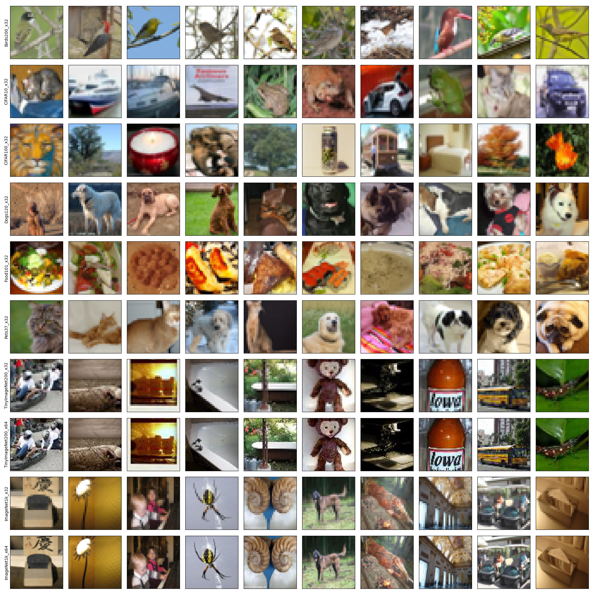

# Built-in Datasets

## Preview
```
python scripts/preview.py
```


## Download

### Birds200_x32
```
wget https://www.dropbox.com/s/ckrz9d88npacqs0/Birds200_x32.tar.gz
tar -xvzf Birds200_x32.tar.gz
```

### CIFAR10_x32
```
wget https://www.dropbox.com/s/8s5unpaxdrt6r7e/CIFAR10_HMC.tar.gz
tar -xvzf CIFAR10_HMC.tar.gz
mv CIFAR10_HMC CIFAR10_x32
```

### CIFAR100_x32
```
wget https://www.dropbox.com/s/bvljrqsttemfdzv/CIFAR100_HMC.tar.gz
tar -xvzf CIFAR100_HMC.tar.gz
mv CIFAR100_HMC CIFAR100_x32
```

### Dogs120_x32
```
wget https://www.dropbox.com/s/8y29ce3kwq9hq30/Dogs120_x32.tar.gz
tar -xvzf Dogs120_x32.tar.gz
```

### Food101_x32
```
wget https://www.dropbox.com/s/2a1z2f63du8nhse/Food101_x32.tar.gz
tar -xvzf Food101_x32.tar.gz
```

### Pets37_x32
```
wget https://www.dropbox.com/s/4ujvea9i99ch8ot/Pets37_x32.tar.gz
tar -xvzf Pets37_x32.tar.gz
```

### TinyImageNet200_x32
```
wget https://www.dropbox.com/s/rcxylz8dn7fm03m/TinyImageNet200_x32.tar.gz
tar -xvzf TinyImageNet200_x32.tar.gz
```

### TinyImageNet200_x64
```
wget https://www.dropbox.com/s/dddexickd88is9l/TinyImageNet200_x64.tar.gz
tar -xvzf TinyImageNet200_x64.tar.gz
```

### ImageNet1k_x32
```
wget https://www.dropbox.com/s/vhi089am8q1tkuo/ImageNet1k_x32.tar.gz
tar -xvzf ImageNet1k_x32.tar.gz
```

### ImageNet1k_x64
```
wget 
tar -xvzf ImageNet1k_x64.tar.gz
```
